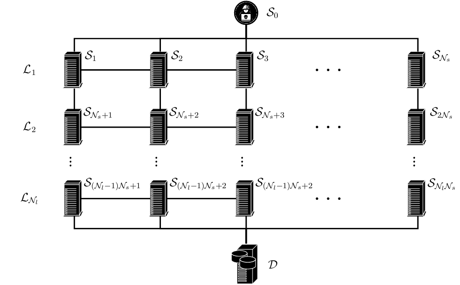

# `gym-idsgame` An Abstract Cyber Security Simulation and Markov Game for OpenAI Gym

`gym-idsgame` is a reinforcement learning environment for simulating attack and defense operations in an abstract network intrusion
game. The environment extends the abstract model described in (Elderman et al. 2017). The model constitutes a
two-player Markov game between an attacker agent and a defender agent that face each other in a simulated computer
network. The reinforcement learning environment exposes an interface to a partially observed Markov decision process
(POMDP) model of the Markov game. The interface can be used to train, simulate, and evaluate attack- and defend policies against each other.
Moreover, the repository contains code to reproduce baseline results using two commonly used reinforcement learning algorithms: 
Tabular Q-learning and Neural-fitted Q-learning using the DQN algorithm. 

Please use this bibtex if you make use of this code in your publications:
```
@misc{gym_idsgame,
  author = {Kim Hammar},
  title = {An Abstract Cyber Security Simulation and Markov Game for OpenAI Gym},
  year = {2020},
  publisher = {GitHub},
  journal = {GitHub repository},
  howpublished = {\url{https://github.com/Limmen/gym-idsgame}},
}
```
If you want to cite the game model, use this bibtex:
```
@inproceedings{adv_rl,
  title={Adversarial Reinforcement Learning in a Cyber Security Simulation},
  author={Richard Elderman and Leon J. J. Pater and Albert S. Thie and Madalina M. Drugan and Marco Wiering},
  booktitle={ICAART},
  year=2017
}
```

Table of Contents
=================

   * [Design](#Design)   
   * [Included Environments](#Included-Environments)
   * [Requirements](#Requirements)      
   * [Installation](#Installation)   
   * [Usage](#Usage)
   * [Manual Play](#Manual-Play)
   * [Baseline Experiments](#Baseline-Experiments)
   * [Future Work](#Future-Work)         
   * [Author & Maintainer](#Author-&-Maintainer)
   * [Copyright and license](#copyright-and-license)

## Design
TODO
<p align="center">

</p>

### MDP Model
TODO

## Included Environments

## Requirements
- Python 3.5+
- OpenAI Gym
- NumPy
- Pyglet (OpenGL 3D graphics)
- GPU for 3D graphics acceleration (optional)
- jsonpickle (for configuration files)
- torch (for baseline algorithms)


## Installation & Tests

```bash
# install from pip
pip install gym-idsgame==1.0.0
# local install from source
$ pip install -e gym-idsgame
# force upgrade deps
$ pip install -e gym-idsgame --upgrade

# git clone and install from source
git clone https://github.com/Limmen/gym-idsgame
cd gym-idsgame
pip3 install -e .

# run unit tests
pytest

# run it tests
cd experiments
make tests
```

## Usage
The environment can be accessed like any other OpenAI environment with `gym.make`.
Once the environment has been created, the API functions
`step()`, `reset()`, `render()`, and `close()` can be used to train any RL algorithm of
your preference.
```python
import gym
> env = gym.make("gym_idsgame:idsgame-v1")
TODO
```

The environment ships with an implementation of the tabular Q(0) algorithm, see the example code below.

```python
import gym
from gym_idsgame.agents.training_agents.q_learning import TabularQAgent
TODO
```

## Manual Play
You can run the environment in a mode of "manual control" as well:

```python
from gym_ids.envs.rendering.viewer import Viewer
TODO
```

## Baseline Experiments

The `experiments` folder contains results, hyperparameters and code to reproduce reported results using this environment.
For more information about each individual experiment, see this [README](experiments/README.md).

### Clean All Experiment Results

```bash
cd experiments # cd into experiments folder
make clean
```

### Run All Experiment Results (Takes a long time)

```bash
cd experiments # cd into experiments folder
make all
```

### Run All Experiments For a specific environment (Takes a long time)

```bash
cd experiments # cd into experiments folder
make v0
```

### Run a specific experiment

```bash
cd experiments/training/v0/random_defense/tabular_q_learning/ # cd into the experiment folder
make run
```

### Clean a specific experiment

```bash
cd experiments/training/v0/random_defense/tabular_q_learning/ # cd into the experiment folder
make clean
```

### Start tensorboard for a specifc experiment

```bash
cd experiments/training/v0/random_defense/tabular_q_learning/ # cd into the experiment folder
make tensorboard
```

### Fetch Baseline Experiment Results

By default when cloning the repo the experiment results are not included, to fetch the experiment results, 
install and setup `git-lfs` then run:
```bash
git lfs fetch --all
git lfs pull
```

## Future Work

TODO

## Author & Maintainer

Kim Hammar <kimham@kth.se>

## Copyright and license

[LICENSE](LICENSE.md)

MIT

(C) 2020, Kim Hammar
